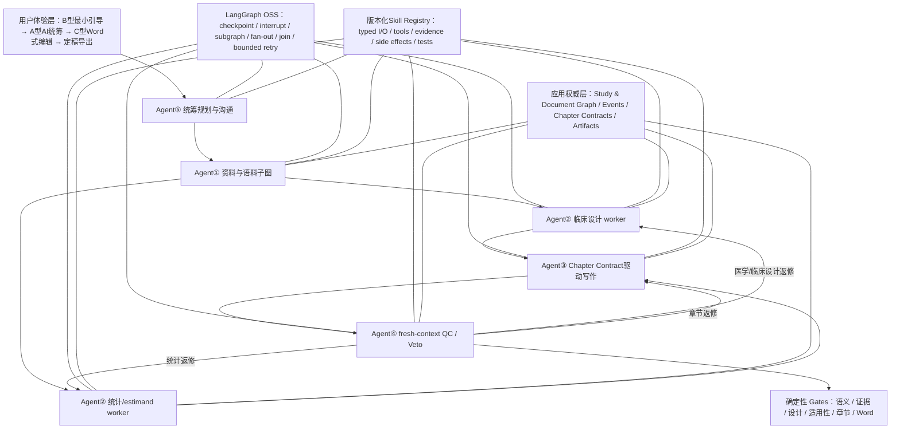

# 医学写作子系统 Protocol 多 Agent 重构正式设计规格

版本：`design-v1.2`  
日期：2026-08-09  
状态：`READY_FOR_USER_SPEC_REVIEW`  
范围：临床试验研究方案（Protocol）设计、写作、审阅与 Word 交付  
设计权威：2026-08-08 至 2026-08-09 用户多轮访谈 D001–D017 及六节视觉确认

## 1. 设计结论

医学写作子系统采用 **Protocol 专属、应用自有权威控制面、LangGraph OSS
负责编排** 的多 Agent 工作流。

它不是五个 Agent 自由聊天，也不是把现有系统推倒重写。目标是：

1. AI 从最少但足够的核心信息出发，完整完成资料发现、竞品方案下载、
   OCR/解析、翻译、语料映射、研究设计、方案摘要、全部适用章节正文、
   独立 QC、Word 原生交付。
2. 用户默认只看到 AI 推荐、少量关键选择和异常；可以一键接受全部，也
   可以逐项点选或输入其他方案。
3. 产物质量目标直接是 `可提交定稿`：无占位符、待确认、日志、prompt、
   AI 痕迹或未完工状态；产品内不建设强制医学/统计/法规会签流程。
4. 研究事实只有一个权威：`StudyDefinition v3 / PICOS-M-A-Opr`；产品内
   `SemanticDocumentRevision` 是唯一的文字、结构与版式工作版本，但不得
   形成与 StudyDefinition 冲突的事实。Protocol 第1章方案摘要、正文、SoA、
   流程图、表格和附录是受控 semantic blocks，DOCX/PDF和独立Synopsis是
   版本化交付投影。
5. TP-MA-07 是Ⅱ/Ⅲ期权威母版；Ⅰ期另建模板合同，但复用同一 Protocol
   平台和工作流定义。
6. 当前多 Agent 控制图只用于 Protocol。Synopsis 仅是 Protocol 完成后的
   独立导出窗口；CSR 将来单独设计自己的多 Agent 工作流。

## 2. 背景与问题定义

### 2.1 已有资产

现有系统已具备值得保留的：

- 124 个公司模板语义节点，其中 110 个叶节点；
- StudyDefinition、ProtocolAssemblyPlan、Source Registry、EvidenceSpan；
- 候选语料/医学准入语料分层；
- durable job、CAS、幂等、租约、重启恢复、immutable lineage；
- OCR/翻译 fidelity、受保护术语和来源定位；
- TipTap 编辑、结构化表格、SoA、流程图和局部 AI 候选；
- DOCX/OOXML exporter、书签、域、引用、表图、hash/manifest 和 Word 回执。

### 2.2 真实缺口

- 约 76/110 个叶节点没有直接确定性章节投影；
- 3,878 条公司语料没有 populated semantic-node/M11 identity；
- 全文仍以统一 prompt、固定 8 章 chunk 和首章检索为主；
- QC 主要检查长度、占位符、顺序和 evidence span 形态；
- StudyDefinition、自由文本、Synopsis、SoA、working copy 曾形成并行权威；
- Journey、Pipeline、Durable Job 和前端投影存在多套状态；
- 历史样例存在“标题齐全、正文接近空白”；
- 最新 r17 停在语料医学准入，未进入 PICOS、实质全文、DOCX 或 Word。

因此重构目标不是再增加一个按钮或 Agent，而是建立统一的事实、证据、
章节合同、控制图、影响传播与验收体系。

## 3. 范围与非范围

### 3.1 本设计覆盖

- Protocol 的建项、资料与语料、研究设计、方案摘要、全文写作、QC、
  Word 式编辑、DOCX/PDF、外部 Word 修改回流和可提交定稿门；
- I/II/III 期、非肿瘤和后续其他适应症；
- Agent App/CLI、API 和本地模型作为可配置执行后端；
- 现有医学写作能力的 strangler 迁移。

### 3.2 明确不覆盖

- CSR 工作流、TFL 数值真相层或 CSR Agent 编排；
- 独立 Synopsis 的单独多 Agent 流程、单独事实源或独立章节状态；
- CTMS、预算、人员排班或供应商采购系统；
- 组织级会签和正式电子签署；
- 在本设计/PoC/独立挑战和实施计划批准前直接替换产品源代码或数据。

### 3.3 术语区分与 Synopsis 边界

- `Protocol Summary` 专指 TP-MA-07 正文中的“1.方案摘要”，由 Agent②生成，
  是 Protocol semantic document 的组成部分，随正文一起通过各层 Gate；它
  对文字表达有版本，但不得生成新的研究事实。任何 Summary→fact 差异必须
  回到 StudyDefinition proposal、CAS和影响传播后再投影；
- `Standalone Synopsis` 专指 Protocol 全链通过后才出现的“独立导出
  Synopsis”窗口及其交付物，不是第六个工作流，也不是独立事实源；
- Standalone Synopsis 由 frozen StudyDefinition、Decision Graph 和最终
  Protocol blocks 确定性投影，按独立模板导出 DOCX/PDF；
- 不允许 Standalone Synopsis 独立编辑出新的研究事实；
- Protocol 相关事实或章节变化后，旧 Standalone Synopsis artifact 自动
  失效，需在 Protocol 重新通过后生成新版本。

## 4. 目标用户与产品行为

目标用户是资深、专业、视觉敏感，但懒惰、不愿填写长表单和学习复杂 AI
操作的医学写作人员。

### 4.1 默认体验

- 系统做研究、分析、设计、写作和返修；
- 用户看到结论，不看模型日志；
- 默认推荐已预选；支持一键接受全部；
- 只有语义多义、关键设计冲突、低置信或重大风险才阻断；
- 用户可以在完整 Word 式画布精修，但精修不是生成全文的必经步骤。

### 4.2 `可提交定稿`

Agent④ clean verdict 和确定性四层门全部通过后，产品自动标记
`可提交定稿`。用户自行做最终人工审阅，但不是产品工作流阻断节点。

任何最终产物均不得含：

- `待医学确认`、`待统计确认`、`待法规确认`；
- TODO/TBD、占位符、模板说明；
- 模型日志、prompt、错误码、任务状态或内部 AI 结论；
- 空标题、统一“无/不适用”或缺乏研究特异性的通用套话。

## 5. 总体架构

### 5.1 权威边界

- Agent 和 LangGraph 只提交 typed proposal/artifact；
- canonical reducer、CAS 和明确采用动作才可改变事实；
- checkpoint、向量结果、Agent 对话、scratchpad 和 telemetry 不是事实源；
- Agent④可否决和调度返修，但不得直接改 canonical facts；
- 每个文档/分支是独立 workflow instance，不能跨项目复用 Agent state。

### 5.2 目标持久化

- PostgreSQL 是 canonical/event/outbox/checkpoint 的首选目标存储，理由是
  多 worker 事务、并发控制、约束、可恢复事件与可观测性；它是可替换的
  repository 实现，不是临床领域合同本身；
- Phase 1 必须以真实迁移、并发、event replay、备份恢复和本地部署运维
  PoC 锁定该选择；若未通过，保留 repository 接口并继续使用满足同一不变量
  的存储实现，不因数据库选型阻塞领域模型；
- 现有 SQLite repositories 在迁移期只通过 adapter 读取或执行明确兼容写；
- shadow run 对 legacy store 绝对只读；切换期 compatibility write 只能是旧链
  已能忽略/读取的 additive 记录，并先冻结 pre-switch snapshot。任何可能让
  旧链误读的字段/row 禁止写入；项目回滚恢复旧 feature flag 和 snapshot，
  新链历史保留在独立 store，不反向改写旧 immutable rows；
- append-only domain events 与 LangGraph checkpoint 分表、分职责；
- 原始文件和每个派生物进入 immutable artifact store，可先以受控本地文件
  存储实现，接口兼容对象存储；
- canonical state 可从 events 和 immutable artifacts 校验重建。

### 5.3 版本化 Skill Registry

Agent 是职责和决策边界，Skill 是可复用、可测试的最小能力单元。每个
`SkillDefinition` 固定：skill/version、输入输出 schema、适用条件、允许的
tools/paths、证据门、side-effect/幂等策略、错误码、测试集和回滚方式。
prompt 只是 Skill 的版本化组成部分，不等于 Skill 合同。

- Agent①串联检索规划、来源版本、下载完整性、OCR/解析、翻译、fidelity、
  抽取、语义映射和医学准入 Skills；
- Agent②串联临床设计、estimand/统计、方案比较、Opr、一致性 reducer 和
  Protocol Summary Skills；
- Agent③为每个叶级 Chapter Contract 注册专属 chapter-skill package；这是
  110 个可验证合同/能力包，不是 110 个常驻 Agent；
- Agent④只调用隔离的验证/反证/定位 Skills，不复用起草者 scratchpad；
- Agent⑤调用规划、调度、决策请求、版本/产物整理和恢复 Skills。

### 5.4 Agent⑤：统筹规划与用户沟通

Agent⑤是唯一用户侧工作流统筹角色，负责：从产品 registry 已审批且与项目
兼容的集合中选择并固定 Protocol template、graph/schema/Skill 版本（不得
自行生成或批准版本）；把目标拆成有依赖和退出门的工作包；建立
`SourceAcquisitionPlan`；展示真实进度/异常/推荐决策；维护 decision queue、
run manifest、artifact manifest、恢复点和用户沟通记录；聚合各 Gate 结果并
交付最终产物包。

Agent⑤不得修改临床事实、替代 Agent④、降低 Gate、重定义稳定分母或把
失败包装为完成。它只通过 typed command 调度 owner；最终 `可提交定稿`
由确定性四层门和 Agent④ clean verdict 共同决定，不由 Agent⑤主观宣告。

## 6. Canonical 数据模型

### 6.1 核心对象

| 对象 | 作用 | 不变量 |
|---|---|---|
| `ResearchSeed` | 建项核心输入与语义归一 | raw input 永久保留；canonical value 可追溯 |
| `SourceAcquisitionPlan` | 项目应检索/获取的来源范围 | 查询、分母、版本规则和例外不可静默缩减 |
| `SourceArtifact` | 原始/派生文件身份 | immutable；logical_source_key+content hash 去重；版本/司法辖区/时效 |
| `EvidenceUnit` | 页/表/段级证据 | locator、上下文、来源角色和质量 |
| `MedicalAdmissionUnit` | 可供设计/写作使用的医学证据单元 | 正向 claim/locator/context/quality 合同通过 |
| `ClaimEvidenceLink` | 主张与支持/冲突/限制 | claim 不得脱离证据解释 |
| `RecommendationOption` | 默认项和备选 | 理由、evidence_class、不确定性、影响可解释 |
| `DecisionRecord` | AI/用户采用结果 | actor/reason；decision_id+snapshot hash+state revision CAS |
| `StudyDefinition v3` | 唯一研究事实源 | PICOS-M-A-Opr、revision、CAS |
| `ApplicabilitySnapshot` | 项目章节适用性 | 规则/事实/version/hash 可审计 |
| `ChapterContract` | 逐叶节点写作/QC/Word合同 | 版本化、不可由 Agent 临时改写 |
| `SubstantiveContentContract` | 逐叶节点正向实质内容合同 | 必需 claims/事实绑定/结构对象/非骨架条件固定 |
| `SemanticBlock` | 正文/表图的语义块 | fact/source/contract/revision 绑定 |
| `SemanticDocumentRevision` | 产品内唯一文字/结构/版式工作版本 | 不得承载与 StudyDefinition 冲突的事实 |
| `ChapterLockSnapshot` | 章节接受状态 | 精确绑定所有上游/产物 hashes |
| `ProjectionArtifact` | DOCX/PDF/Standalone Synopsis交付投影 | 引用同一 fact/document revisions |
| `SkillDefinition` | 版本化可执行能力合同 | typed I/O、证据、工具、副作用和测试固定 |
| `WorkflowRun` | 一次 Protocol 图运行身份 | graph/schema/template/skills/revisions 隔离 |
| `DomainEvent` | 权威审计 | append-only、actor/action/reason/hash |
| `SubmissionEvidencePackage` | 可提交定稿的独立审计包 | facts/contracts/decisions/QC/Word receipt hashes 闭合 |

### 6.2 状态纪律

`raw → normalized → proposed → confirmed → frozen → superseded/quarantined`

- 状态不可静默倒退或覆盖；
- rejected/superseded 候选保留历史；
- 无法可靠映射的旧数据进入 quarantine；
- final projection 只能消费 current+confirmed/frozen facts。
- material identity/staleness hash 只由规范化实质内容和相关规则/来源 identity
  计算，不能把 journey/revision counter、更新时间或显示进度等运行元数据
  混入并导致未变事实被错误判 stale。

## 7. Research Seed 与语义归一化

固定八类核心信息：

1. 研究药物；
2. 剂型与给药途径；
3. 预期剂量/范围/队列；
4. 靶点或作用机制；
5. 适应症；
6. 临床分期；
7. 成人/青少年/儿童，多选；
8. 对照类型或具体方案。

默认中国国内多中心。用户上传 IB、Synopsis 或其他资料时，AI 优先抽取并
预填，不让用户重复录入。

归一化支持简称、别名、研发代号、中英文混输、拼写变体、不完整表达、
多剂量 cohort 和自然语言对照。保存 raw input、ontology/controlled ID、
单位标准化、候选、置信度和匹配理由。

- 高置信唯一匹配：自动采用并可撤销；
- 多个合理候选：预选推荐并二次确认；
- 低置信/关键冲突：fail closed；
- 高精度检索前八类均须 confirmed 或有明确结构化范围。

## 8. 来源权威与竞品相关性

### 8.1 来源按事实类型分工

- 药物事实：当前项目、最新版 IB、药物自身临床/非临床资料；
- 监管/方法：目标司法辖区当前有效法规、指导原则和标准；
- 临床诊疗：最新且适用的高质量指南/共识；
- 工具/量表：原始和验证资料；
- 竞品方案/注册/论文：设计比较、参数、可行性和措辞参考；
- 公司语料：模板、结构与中文监管表达。

竞品不得自动变成目标药物事实。

### 8.2 版本与时效

监管/指南/共识保存生效/失效、被替代、司法辖区、适用范围和检索日期。
当前有效最新版具有规范性优先级；旧版降权并标记历史用途。新版范围不同
时必须比较适用性，不能机械按日期排序。

### 8.3 竞品评分

评分分解至少包括：时间/状态、靶点/机制/药理、适应症亚组、严重程度、
治疗线次、人群/年龄/地域/生物标志物、剂型/途径/剂量、分期/设计/对照、
endpoint/estimand/工具/时间点、样本量/中心/招募，以及来源完整性和质量。

输出分维度得分和主要加减分原因，不输出不可解释的黑箱总分。
相关性或权重无法稳定判断时，不由模型暗中拍板；形成带默认推荐、备选、
差异证据和影响分析的问题卡交给用户一次确认。

### 8.4 SourceAcquisitionPlan 与零结果纪律

Agent⑤和 Agent①在下载前根据 Research Seed、模板适用性和 Chapter
Contracts 固定 `SourceAcquisitionPlan`：来源类别、注册库/站点、同义词与
中英文检索式、日期/司法辖区、纳入排除、预期字段、完整性标准和稳定分母。

Protocol 最小来源类不可由 Agent⑤自由删减：项目/IB与药物资料、目标司法
辖区监管/指导原则、适用指南/共识、临床试验注册库、竞品 Protocol、终点/
量表原始与验证资料（适用时）、同行评议证据和公司模板/语料。每类若确实
不适用，必须由 Applicability rule 或用户采纳的 reason-coded DecisionRecord
省略；“未检索到”“下载失败”“成本高”不是不适用理由。

资料链维护三个互不替代的分母：

1. `required_discovery_denominator`：计划中所有来源类、注册库和查询族；
2. `researched_competitor_denominator`：已识别且完成相关性判定的全部竞品，
   包括有链接、无链接、仅注册信息、付费墙或访问受限对象；
3. `linked_protocol_denominator`：其中存在可下载 Protocol 链接的稳定集合，
   严格进入 E1 全量门。

竞品方案零结果不能用 `0=0` 自动通过。必须完成药物/靶点/适应症亚组/
机制/人群/阶段/登记号等扩展检索、记录每次查询和响应、区分网络/权限/
检索策略/名称归一/确无公开 Protocol，并生成可复现根因。任何竞品入选或
排除、指南版本替换、分母变化都产生 DecisionRecord；不得为通过 Gate
静默删除失败对象。

## 9. Agent①：资料与语料子图

### 9.1 责任

1. Research Seed 语义归一；
2. CT.gov/注册库、IB/上传、监管、指南、文献、量表和公司语料发现；
3. 竞品相关性与时效评分；
4. 下载、文件身份和完整性验证；
5. OCR/解析、翻译、结构整合和 fidelity QC；
6. claim/evidence 抽取；
7. 叶级 semantic-node 映射；
8. 医学实质准入、章节覆盖、冲突和缺口分析。

### 9.2 输出

`EvidenceCorpusPacket`：SourceAcquisitionPlan、来源目录、hash、证据单元、
竞品设计矩阵、章节覆盖、缺口/冲突、OCR/翻译 lineage 和稳定分母。

### 9.3 Gate E0：发现范围与可复现性

所有必需来源类别都完成计划中的查询、版本核验和根因记录；网络错误、
认证错误、名称归一错误和确无结果必须区分。零竞品结果只有在 8.4 的扩展
检索和独立可复现检查通过后才可能进入用户异常决策，不能静默视为完成。
E0 同时输出 researched competitor 全集及 `has_protocol_link`、访问状态和
证据等级；无链接/仅注册记录对象不能从分母或后续设计证据说明中消失。

### 9.4 Gate E1：竞品资料全量可用

对已调研、已判定为竞品且有下载链接的方案：

`linked_competitor_count = integrity_pass = ocr_or_parse_pass =
translation_fidelity_pass`

且 pending/failed 为 0，才可通过。

下载验证包括 MIME、size/hash、可打开、页数、Protocol 完整性、非 HTML
伪装、无截断/损坏。OCR/解析验证页序、方向、逐页覆盖、正文和表格可识别、
无缺页/异常空白/乱码。翻译验证标题/段落/表格/页码对齐、数字/单位/否定、
受保护术语、引用和章节完整，保留 source-target locators。

原文已是目标中文且无需翻译时，必须产生带语言识别和结构完整性证据的
`translation_not_required_pass`，再计入 translation fidelity 分母；不得以
空任务冒充通过。稳定竞品集合一经固定不能为了清零失败而缩小；只有基于
科学相关性/文档身份的新证据完成显式 reclassification，保留旧集合、理由
和审批事件后才可变更，单纯“无法下载”不是排除理由。

任何会改变 E1 冻结分母的 reclassification 必须以用户问题卡呈现原身份、
新证据、失败历史、推荐与下游影响，并由用户产生 reason-coded
DecisionRecord；Agent①/⑤不得自行批准。E1 不提供下载/OCR/翻译质量豁免：
如果对象仍是真实竞品 Protocol，就必须修复至通过或保持阻断；用户只能在
新证据证明其并非竞品/并非 Protocol/链接身份错误时批准重分类，不能仅因
难以获取或识别而把它移出分母。旧状态和失败 artifacts 始终保留在
EvidenceCorpusPacket。

同一注册号/文档版本/来源URL族形成稳定 `logical_source_key`；重取、镜像、
fallback 或 restart 得到相同 content hash 时复用同一 immutable artifact
lineage，不新增逻辑竞品或重复计数。内容真正变化时创建新 source revision，
旧版本保留并使依赖它的准入、设计和章节失效。

无法通过时继续替代链接、重取、解析/识别/翻译修复；需要用户时提供问题、
推荐选项和分析。不能用 44 字引言、heading-only span 或薄弱通用段落冒充
章节证据。

### 9.5 Gate E2：监管与指南时效完整

目标司法辖区当前有效法规、指导原则、适用指南/共识及其被替代关系均完成
核验；检索日期、有效范围、旧版用途和冲突解释齐备。只有旧版、未知版本
或无法确认适用性时阻断，不得把“最新”简化为发布日期最大。

### 9.6 Gate E3：语料医学准入与章节覆盖

准入以 claim/evidence 的医学实质、locator 和 Chapter Contract 适配为准，
不得按字符数、标题存在或批量状态放行。输出 applicable 节点覆盖矩阵、
缺口、冲突和证据质量；缺口若影响研究设计或必需正文则阻断到明确 owner。

每个 `MedicalAdmissionUnit` 必须具备：claim_type、关联 fact paths、来源角色、
支持/冲突/限制关系、可解析 body/table/figure locator、必要上下文窗口、证据
质量、semantic node/Chapter Contract 映射和 source hash。标题、TOC、页眉
页脚、仅章节引言、heading-only span 或脱离上下文的短句不能单独证明章节
覆盖。设计关键节点所需的 claim 类型和独立证据单元由 Chapter Contract
正向列出；“有一段文字”或“字符数达标”均不是准入谓词。

r17 的 44 字资格标准引言、无 objectives/endpoints 的薄弱证据、heading-only、
长通用套话和短而真实但无目标 claim 的 span 均进入不可删除失败 corpus；
Gate E3 的任何实现必须以这些 fixture 证明 fail closed。

准入 verdict 以 `(item_id, item_revision, evidence_hash)` 逐项绑定并保存
locator、reason、actor和时间。单项 `REJECT` 不能被“一键接受全部”或任何
batch action 覆盖；只有新 evidence/revision 完成新的逐项实质审阅并得到
`PASS` 才能改变。批量接受只是对 latest verdict=`PASS` 项执行幂等采用，
遇到 REJECT/UNKNOWN/STALE 必须跳过并显示原因。

## 10. Agent②：方案设计与摘要子图

### 10.1 内部角色

- 临床 worker：疾病/人群、干预/对照、医学目的/终点、安全、评估和 Opr；
- 统计/estimand worker：estimand、样本量、alpha、多重性、中期分析、
  分析集、缺失数据、敏感性和统计方法；
- deterministic reducer：objective→estimand→endpoint→analysis、效应假设→
  样本量、访视→分析窗口等跨域一致性。

### 10.2 PICOS-M-A-Opr

- P：疾病/亚型/严重度/线次/标志物/既往治疗/基线风险/器官功能/年龄/
  screen/run-in/washout/退出；
- I：剂型/途径/剂量依据/滴定/周期/依从性/减量/暂停/重启/停药/供应；
- C：对照伦理/SOC/地区差异/double-dummy/交叉/救援/背景治疗/盲态；
- O：objective→estimand→endpoint、窗口/基线/工具/评估者/伴发事件/缺失；
- S：phase/part/cohort/随机/盲法/分层/样本量/alpha/多重性/中期/DMC；
- M：允许/限制/禁用药物、时间窗、预处理、支持/补救和相互作用；
- A：SoA、窗口、影像/实验室/PK/PD/PRO/COA/标志物/AE/SAE/AESI；
- Opr：患者池、中心、竞争研究、招募、周期、访视负担、样本物流、中央
  实验室/阅片、供应、随机盲态、远程操作和关键 vendor 依赖。

Opr 反向约束人群、中心数、样本量、访视、评估和研究周期，不扩展为
CTMS/预算/采购。

### 10.3 关键设计总览

每张卡片包括推荐默认项、其他可行项、简短理由、证据、相对利弊、影响和
`其他，请输入`。支持一键接受全部或逐项改选。自定义输入经结构化解析、
一致性/可行性检查和影响预览后采用。

每个 RecommendationOption 必须标注 `evidence_class`：`project_primary`、
`regulatory_or_guideline`、`competitor_full_protocol`、`registry_only`、
`peer_reviewed`、`company_style_only` 或 `none`，并列出支持与冲突证据。
模型置信度不能替代 evidence_class。

卡片按原子设计决策拆分，至少覆盖研究目的、主要/次要 estimand 与终点、
人群、剂量、对照、随机/盲法/分层、样本量假设、alpha/多重性/中期分析、
访视/评估、合并用药、安全监测和 Opr；不得把这些折叠成一个只能整体接受
的大段结论。

只有证据冲突、低置信或重大安全/可行性风险阻断。

### 10.4 输出与 Gate D1

输出 accepted/frozen StudyDefinition revision、DecisionRecords、
ApplicabilitySnapshot、首页和 Protocol Summary（正文“1.方案摘要”）。
Gate D1 要求必需事实 confirmed、临床/统计/Opr 一致、所有推荐可解释、
适用性无未决冲突；此处不生成 Standalone Synopsis artifact。高影响设计
参数若声称来自竞品细节，必须有 `competitor_full_protocol`；只有 registry
或无 Protocol 证据时必须降低措辞和置信、给出问题卡/备选，并由用户采用，
不能静默伪装为竞品方案结论。零注册/零 Protocol 结果从不自动算设计证据
充分。

## 11. 模板、Chapter Contract 与适用性

### 11.1 模板权威

TP-MA-07 是Ⅱ/Ⅲ期公司母版，当前权威文件为
`/Users/smkzw/Documents/指导原则及临床试验规范合集/CRP知识库/模板/TP-MA-07 临床试验方案（2期或3期）.docx`，
SHA-256 为
`a28e95d738ffad9199eee44a965164d89a04022dbcac7ea01a999bde5cf34f5e`。
稳定语义节点、主章节顺序、表图位置逻辑、
样式、section、域、书签和交叉引用版本化。AI 不得自由改名/合并/移位。

Ⅰ期另建模板和节点树，但使用同一 Protocol workflow 与平台内核；Phase 3
前必须由真实Ⅰ期公司模板建立 hash、节点树和 100% Chapter Contract，模板
尚未确定时不得以Ⅱ/Ⅲ期母版或模型臆造结构冒充Ⅰ期验收完成。

### 11.2 叶级 Chapter Contract

每个叶节点定义：

- identity/template/M11 anchor/适用性；
- required/optional/forbidden fact paths；
- 来源角色、最低证据门和 locator；
- paragraph/table/SoA/figure/formula/instrument 输出 schema；
- allowed/forbidden/qualified claims；
- 跨事实/章节 dependency/impact/conflict edges；
- chapter-skill ID/version、typed I/O 和错误码；
- 起草 role/prompt/capability contract；
- deterministic/clinical/statistical/regulatory QC；
- repair owner、bounded attempts、人工升级条件；
- Word style/section/bookmark/field/cross-reference/pagination contract。

每个叶节点同时定义 `SubstantiveContentContract`：必需 claim 集、必须绑定的
StudyDefinition paths、最低来源角色/MedicalAdmissionUnit、必须出现的研究
特异性元素，以及适用时必需的 paragraph/table/SoA/figure/formula/instrument
对象和对象内必填单元。通过条件按 claim/object/binding 覆盖计算，不以总
字数替代。可确定性识别的空表、同义反复、模板改写、跨项目仍完全成立的
通用段落和重复文本进入 `skeleton_risk`；任一必需 claim/object 缺失或仅由
骨架文本支持即 fail closed。

Chapter Contract 注册本身也有 non-vacuous meta-gate：每个叶节点至少必须
声明 required fact path、required MedicalAdmissionUnit/source role，或模板
强制的 project-specific claim/object obligation 之一，并带正向 QC；三类均
为空的合同是 schema-invalid，不能计入 110/110。机械 registry lint 必须先
证明 110/110 non-vacuous，Agent③才可启用。

110 个 TP-MA-07 叶节点必须 110/110 有合同，但每个项目只写适用节点。

dependency/impact edge 采用显式类型：`fact_to_chapter_hard`、
`evidence_to_chapter_hard`、`chapter_write_order`、`cross_consistency`、
`structure_numbering`、`word_style`。驱动写作顺序的 hard/order 图必须无环；
双向一致性只能使用 `cross_consistency` 交给 reducer/validator，不能形成调度
环。未知边、hard cycle 或缺失 owner 均 fail closed。高 fan-out 变化可以在
UI 批量展示/接受，但不能为减少提示而截断应解锁的章节。

“source-bound”不只指外部文献：允许绑定已核验外部证据、项目原始资料、
用户明确决策或从它们生成的 confirmed StudyDefinition facts；每个关键主张
必须能回到合法来源角色和 locator/DecisionRecord，模型自由生成本身不是
来源。

### 11.3 ApplicabilitySnapshot

每个节点记录 applicable/conditional/not-applicable、依据、触发 facts、规则
版本和 hash。条件性 not-applicable 节点不进入正文/TOC，并重建编号和引用。
模板必须保留的节点需写项目特异科学说明，不能只写“无/不适用”。

## 12. Agent③：全文写作子图

1. 从 ApplicabilitySnapshot 和 dependencies 建 chapter DAG；
   hard/order cycle 在任何模型调用前失败并定位到具体 contracts/edges；
2. 强相关节点组合成 writing packet；
3. 依赖满足的 packet 并行 fan-out；
4. 临时 worker 调用该节点的 chapter-skill package，消费 Chapter Contract、
   confirmed facts 和 admitted evidence；
5. section validator 在汇合前检查；
6. reducer 组装跨章、表、图、SoA、引用并运行一致性；
7. 只重跑失效节点，不固定 8 章批次，不因局部失败重写全稿。

Gate W1：全部 applicable 节点有 source-bound 实质内容；required facts、
evidence、claim policy、SubstantiveContentContract 和 Word block schema 满足；
每个必需 claim/结构对象完成研究特异事实绑定，`skeleton_risk` 为0；空标题、
空表、模板套话、占位符、待确认、内部标记和 AI 痕迹为 0。历史空正文、
106标题/2,627字符和同类“结构齐全但不可提交”样例必须作为 W1 回归失败。

## 13. Agent④：独立 QC 与返修

Agent④使用 fresh context，只接收待审 artifact、验收规则和必要证据；优先
使用与起草者不同的模型/执行后端，无法做到时至少使用全新隔离会话且不带
起草 scratchpad。每条 finding 包含 locator、类型/严重度、违反的合同、证据、
影响、repair owner 和验收条件。

Q1 输入必须附应用确定性生成的完整 coverage digest，而不是让 Agent④在
长文中抽样：每个 applicable node→SemanticBlocks→required claims/objects→
StudyDefinition paths→ClaimEvidenceLinks/DecisionRecords 的闭合矩阵，以及
相对上一 revision 的 diff、Applicability delta、章节锁/自动解锁历史、
skeleton/admission/Word validators 结果和所有未闭合定位。digest 必须覆盖
110/110 contracts 后再分包给 verifier；Agent④可分片审阅，但 final reducer
只有确认每一 digest row 都被审阅并汇合一致时才可出 clean。

- 语言/格式/引用/编号：确定性工具或 Agent③定点修复；
- 医学事实/设计：返回 Agent②临床 worker；
- estimand/样本量/统计：返回统计 worker；
- 章节内容：返回 Agent③；
- 每次返修产生新 revision/hash 并由新审阅尝试复核；
- 达到合同配置的有界尝试上限、重大证据冲突或科学不确定性才询问用户。

Agent④不得边判定边静默改事实。Gate Q1 要求 current artifact 的 P0–P4
`open_count=0` 才可 clean。finding 只能用 typed disposition 关闭：

- `fixed_verified`：新 artifact/revision 通过独立复核；
- `duplicate_of`：指向仍被处理的同一问题；
- `artifact_superseded`：原目标 artifact 已被新 revision 取代，且新 revision
  重新审阅；
- `design_choice`：仅限合同允许的等效方案，用户 DecisionRecord 与新事实/
  产物均已通过复核。

自由文本 `superseded`、`accepted_risk`、`not_planned` 或达到重试上限均不能
变成 clean。P0/P1及临床/统计/监管 P2 不能被豁免；用户选择必须先形成新的
合法设计事实和产物，再由独立复核关闭原 finding。P3/P4 只有在合同明确为
非缺陷的允许设计选择时才可转 `design_choice`，否则同样必须修复。

最终 Q1 对 P0/P1 finding 的 producer 与 final verifier 必须使用不同 reviewer
execution identity；有多个合格模型时必须选择不同 provider/model。只有单一
模型可用时，若不能用确定性验证完整覆盖相关合同，则保持阻断，不得仅靠
同模型新会话宣告 clean。发给 repair owner 的包只包含 locator、违反合同、
必要证据、影响和验收条件，不携带 reviewer 代写的整段答案。

## 14. 章节 AI 统筹、锁定与影响传播

每个章节点都有 AI 统筹/异常区，显示推荐、备选、理由、来源、异常、影响
和一键接受全部。

`drafting → review_ready → locked_current → auto_unlocked → syncing/re-QC`

Chapter LockSnapshot 绑定 chapter/semantic IDs、StudyDefinition、corpus、
applicability、contract、prompt/model/tool、block、closed finding 等 revisions
和 hashes，以及 actor/action/idempotency key。

一键接受和单项采用通过 `(decision_id, snapshot_hash, expected_state_revision)`
执行 CAS；重复点击、重复 worker 或 restart 只返回既有 DecisionRecord，不
重复改变事实、触发模型调用或生成新锁。

后续变更命中 dependency edge 时：

1. 自动解锁受影响章节并保留旧锁历史；
2. 不受影响章节保持锁定；
3. 自动生成同步修订、局部 diff 和重新 QC；
4. 只有未调用模型、输入与算法版本固定、输出可重复且只涉及编号/引用/样式
   等确定性投影的节点，在 clean 后可自动重锁并通知用户；
5. AI 实质重写、新选项、证据冲突或不确定性保持解锁，回到章节统筹区。

用户或选区 AI 编辑 locked_current 章节时，系统先产生显式 auto-unlock 事件。
编辑 diff 使用规范化 `EditClass`：`format_only`、`wording_only`、
`structure_or_word_object`、`fact_or_uncertain`。任何触及剂量/频次/单位、
人群/入排、目的/终点/estimand、评估时间窗、治疗/对照、随机盲法分层、
样本量/统计、安全规则、SoA/访视、适用性触发或其他 confirmed fact path 的
变更均为 `fact_or_uncertain`；分类不确定时默认 `fact_or_uncertain`。

`wording_only` 只有在受保护值、fact bindings、引用和结构对象均不变且
validator 通过时成立。`fact_or_uncertain` 必须转 typed fact proposal，经过
采用和 impact propagation 后才可重新锁定，不能让画布文字、Protocol
Summary、AI选区操作或外部 Word 静默覆盖 StudyDefinition。

## 15. AI-first 界面与 Word 式编辑

### 15.1 页面层次

- 顶部 A：AI 结论、关键设计、异常、真实进度和一键接受；
- 下方 C：目录、最终版式正文、AI/证据/QC 侧栏；
- B：只在 Research Seed 或中途阻断信息不足时一问一页出现。

推荐/异常和 semantic block 双向定位。overlay 区分推荐/已采用、待选择、
证据摘要和 QC 阻断，可开关且不进入最终 Word。

### 15.2 完整 Word 式直接编辑

同一文档模型同时支持最终样式渲染、直接编辑、AI修改和DOCX导出。能力
覆盖样式/字体、段落、列表、表格、图片/图表/SoA、题注、公式、脚尾注、
引用、页眉页脚、页面/分节、目录/书签/域/交叉引用、查找替换、撤销重做、
批注/修订和常用快捷键。

具体编辑器内核须在 Phase 6 前做开源许可证、分页/OOXML round-trip、性能
和兼容 PoC；能力合同不因当前 TipTap 或某个候选库的限制而缩减。
若 PoC 不能满足 D011/D012，Phase 6/7 和 `可提交定稿` 保持阻断，转入新的
开源候选或最小自研/原生Word桥接方案评估；不得发布“近似 Word”并把缺失
能力转交用户，也不得以 HTML/LibreOffice 验收代替 Microsoft Word 原生门。

所有手工编辑均以 semantic transaction 写入新的
`SemanticDocumentRevision`；纯格式/措辞可局部采用，结构或事实语义变化
必须经过 contract validator、证据检查、typed fact proposal 和影响预览。
保存按钮不能形成绕过 StudyDefinition、章节锁或 QC 的第二事实源。
Protocol Summary 的编辑使用相同 EditClass 和 CAS 规则，不能因其位于首页/
第1章而绕过正文依赖图。

### 15.3 选区 AI

稳定选区为：

`block_id + semantic_node_id + range + revision + selected_hash`

右键至少有 AI润色，并扩展改写、扩写、缩写、中文监管语气、补证据和
一致性。默认保护 facts、数字、单位、术语、引用、书签和格式；提供 3–5
候选、局部 diff、采用/再生成/撤销。事实语义变化必须转 canonical patch。
任何分类不确定的选区 AI 结果按 `fact_or_uncertain` 处理，采用前显示受影响
的 StudyDefinition paths 和将自动解锁的章节。

## 16. Word 导出、原生验收与回流

- DOCX 是完整可提交、可继续编辑的交付物；
- 导出携带不可见 semantic/bookmark/template/revision/hash lineage；
- 外部 Word 修改可重新导入；原文件和回流文件均 immutable；
- diff 分为措辞、格式、结构/Word 对象、研究事实；
- 回流 diff 使用同一 EditClass；无法确定为纯格式/措辞时默认
  `fact_or_uncertain`；
- 事实变化转 typed fact proposal；无法映射、书签丢失、结构严重变化或
  并发冲突 fail closed；
- 合并创建新 revision，并重新章节/跨章/Word QC；
- 原生验收：Word 打开、域更新、目录/引用跳转、分页/表图/页眉页脚、
  保存、重开、规范化 OOXML 结构指纹、可容差的页面/视觉差异和
  export→edit→reimport→export round-trip；不使用易受 Word 版本、字体或
  打印驱动影响的逐页像素 hash 作为唯一通过条件。
- Word 导出的 PDF/逐页对照仍是必需视觉证据之一，与结构指纹、域/跳转
  功能和 round-trip 共同判定；“不是唯一条件”不等于可以省略页面证据。
- Standalone Synopsis 只有 Protocol 四层定稿门通过后才能导出；它有独立
  的模板/Word artifact 验收，但失败只阻断该导出，不反向创造新的临床事实。

## 17. AI Role 与 Harness Runtime

### 17.1 四类独立产品 AI

| Role | 配置 |
|---|---|
| LLM | provider/model；thinking on/off；effort；context |
| OCR AI | provider/model；不显示 thinking 设置 |
| Translation AI | provider/model；不显示 thinking 设置 |
| OCR/Translation Support AI | provider/model；thinking on/off；effort |

每次记录 role、provider/model、prompt/tool versions、input/output hashes、
token/latency/attempt/fallback 和终态。OCR 绑定 file/page model identity；翻译
绑定 source-target spans 和 fidelity。

### 17.2 Harness Adapter

Node execution 可选择 Direct API、本地 runtime、Codex 指定模型、OMP 指定
模型或其他经验证 Agent App/CLI。

统一 `NodeExecutionContract`：

- role、harness、provider、model、effort；
- session ID、same-session recovery、timeout/fallback；
- prompt/schema、allowed tools/paths、permission policy；
- input artifact hashes、typed output schema/artifact；
- input sensitivity tier、allowed provider/region、redaction/retention policy；
- logical_call_id、reservation/attempt/transport_attempt、terminal state、
  idempotency、audit、cost/quota。

等待/延迟不重复派发；terminal failure、recovery exhausted 或验收失败才
fallback。Agent 只能经产品 API 提交 proposal/artifact，不能直接写库。
Harness 输入按最小必要范围打包，凭证不进入 prompt/checkpoint/artifact，
敏感内容的加密、脱敏、留存和删除策略由产品策略层执行。
原始 IB/项目机密默认以 artifact reference+最小片段传递，不进入通用
checkpoint/trace。跨 provider fallback 必须从 canonical source 重新执行数据
分级、provider/region allowlist 和最小打包，禁止把上一会话、scratchpad 或
原始敏感 payload 原样转交下一 provider；策略不允许时 fail closed。

每次模型/Agent调用先写 append-only `ExecutionReservation`，terminal state
只能为 `completed`、`failed` 或 `unknown_outcome`，记录 input/output hashes、
provider session、attempt与transport attempts。输入 hash 相同的 completed
结果直接复用；`unknown_outcome` 绝不自动再次派发，必须先做同 session/
provider结果回收，仍不明时以用户可见的显式 retry decision 创建新 attempt。
restart、fallback 和 timeout 不能覆盖旧 reservation 或伪造 failed。

## 18. LangGraph、恢复与错误处理

LangGraph 仅承担 graph execution；应用事件账本承担法规/业务审计。

Domain events+immutable artifacts 是可重建 canonical truth；LangGraph
checkpoint 只是执行位置/临时状态，永远不能单独证明业务完成。canonical
mutation 与 outbox 在同一事务提交；外部副作用通过 inbox/idempotency key
回写结果事件。若 event 已提交而 checkpoint 未提交，resume 从 event 重建并
跳过已完成效果；若 checkpoint 声称完成但缺少对应 event/artifact，立即
quarantine/fail closed，不能沿 checkpoint 继续。

- 每个关键节点完成后 checkpoint；
- interrupt 前副作用封装为幂等 task；
- 下载、模型、写库、导出均有 idempotency key；
- 执行语义允许 at-least-once，但业务效果按 logical source、DecisionRecord
  CAS、artifact content address 和 outbox 实现 exactly-once semantic effect；
- graph_version/state_schema_version 固定；无迁移时旧 checkpoint fail closed；
- DomainEvent 带 event_type/schema_version/upcaster identity；不认识的事件版本
  或无确定性 migration/upcaster 时 quarantine/fail closed，不能猜测回放；
- lease/heartbeat 保持长任务；不以无新输出判定失败；
- typed error 含阶段、对象、错误码、可重试性、owner 和恢复动作；
- 错误码采用稳定命名 `MW-PRO-<GATE>-<OBJECT>-<CAUSE>`，UI 显示可理解
  解释，审计保留原码、对象 ID、attempt、owner 和恢复结果；
- facts 变化通过 impact graph 只失效相关下游；
- harness fallback 先查询同一 logical work key 的已验证 artifact；除非前一
  artifact 完整性失败，不得为了换 provider/model 重做已完成副作用；
- `unknown_outcome` reservation 未被明确处置前，graph不能把同一 logical
  call 当 failed 重发，也不能把对象标记 completed；
- 持久化、证据或 QC 失败时不能继续生成假定稿。

长运行中 pinned Skill/graph 被发现有缺陷时，不得热替换同一 run。Agent⑤
只向用户提供带影响说明的两个恢复动作：基于显式 migration 在新 run
revision 继续，或终止并保留所有 artifacts/decisions；两者均不得覆盖旧
checkpoint、reservation或完成证据。

## 19. 四层 `可提交定稿` 门

1. StudyDefinition、Protocol Summary（正文第1章）、正文、SoA、表图、附录、
   统计事实和交叉引用使用一致的 fact/document revisions；
2. 所有 applicable 节点有实质、source-bound 内容；内部痕迹为 0；
3. Agent④医学/统计/监管/中文/证据/跨章/模板/结构 clean；
4. 真实 Microsoft Word 原生与 round-trip 验收通过。

任何层失败返回明确 owner 定点修复，不能把格式问题留给用户。
四层通过时同时冻结 `SubmissionEvidencePackage`：fact/document revisions、
Source/Corpus manifests、Applicability、Chapter/Skill contracts、DecisionRecords、
Agent④ findings/dispositions/clean verdict、Word receipt、模型/工具版本和全部
关键 hashes。该包供下游人工审阅/审计，不是强制会签，也不得把内部日志
嵌入正式 Protocol 正文。

## 20. Strangler 迁移路线

### Phase 0：冻结与基线

建立源/数据/hash清单、r17隔离、真实失败 corpus、黄金 Word/PDF、模块和
数据库 ownership，以及可回滚工程边界。失败 corpus 至少固定 44字符/
heading-only/长通用证据、空正文骨架、零注册结果、重复 resume 和非可提交
Word 样例，作为后续 Gate 的不可删除回归。
同时完成 §23.4 Microsoft Word 原生回执生产者可行性 PoC；未通过则后续
Word/编辑器 Phase 不得承诺上线时间或降低验收。

### Phase 1：权威内核

落地 v3 facts、decision/claim/evidence/document graph、events、artifact、
SemanticDocument、Skill/Role/Harness Registry 和 legacy read adapters，并
完成目标存储、transactional outbox/inbox、event↔checkpoint 崩溃恢复 PoC。

### Phase 2：LangGraph PoC

用入排、主要终点/estimand、样本量三个高风险合同比较 LangGraph、现有
typed facade 和 MAF。强制 kill、重复 resume、并发编辑、旧图迁移、event
replay 和 fresh reviewer isolation 全部通过后锁定 LangGraph。
同一 logical Protocol 在 kill/retry/fallback 后只能形成一个有效 artifact
lineage；重复采用只产生一个 DecisionRecord semantic effect。

### Phase 3：全部章节合同

TP-MA-07 110/110 合同、SubstantiveContentContract、MedicalAdmissionUnit、
适用性、typed dependency/impact、cycle/high-fanout、Word blocks 和错误注入；
Ⅰ期独立模板树。

### Phase 4：Agent①

迁移检索、评分、下载、OCR/翻译、证据、准入和映射，关闭 E0–E3 全部
资料门，其中 E1 严格执行全量竞品稳定分母，并覆盖无链接/仅注册/零结果
路径和 recommendation evidence_class。

### Phase 5：Agent②

临床/统计设计、总览、Opr、StudyDefinition、适用性和 Protocol Summary。

### Phase 6：Agent③与 A+C UI

dependency-aware 写作、章节锁、完整 Word 编辑、选区 AI 和影响传播。
编辑器 PoC 未满足 D011/D012 时本 Phase 不得标记完成。

### Phase 7：Agent④与 Word

独立 QC、owner repair、原生 Word、外部修改回流，以及 Protocol 四层门
通过后的 SubmissionEvidencePackage 和 Standalone Synopsis 导出窗口。

### Phase 8：双轨与上线

旧系统只读，按项目 feature flag/shadow run 对比事实、证据、适用性、章节
和 Word；新链失败不改旧行；通过后逐项目切换。最终 cutover 前始终保留
pre-switch snapshot、旧链可读性测试和按项目回滚演练；compatibility writes
不得破坏回滚。

## 21. 保留、适配与替代

### 保留升级

semantic IDs/M11/适用性、Source/Evidence、OCR/翻译 fidelity、CAS/幂等/
租约/恢复、protected tokens、DOCX exporter、Word receipt 和缺陷回归。

### Adapter 包裹

现有 repositories/SQLite、Journey/Pipeline/Durable Job、StudyDefinition v2、
AssemblyPlan、working copies、editor service、demo/real resolver、旧编号/书签。

### 逐步替代

多个事实权威、固定8章chunk/首章检索、通用prompt/regex QC、前端自维护
进度、批量准入越过实质门、全文字符串选区和全链整批重跑。

## 22. 验收与测试合同

### 22.1 工程与恢复

- 110/110 TP-MA-07 合同覆盖及Ⅰ期模板合同；
- 每个 applicable 叶节点的 SubstantiveContentContract、必需 claim/object/
  fact binding 和 skeleton fail-closed 覆盖；
- registry lint 证明 110/110 Chapter Contracts non-vacuous；
- event replay、graph/schema migration、restart、duplicate resume、CAS、
  concurrency、idempotency、side-effect replay 和 reviewer isolation；
- event已提交/checkpoint未提交及反向不一致都 fail closed 并可恢复；
- 同一 logical source 重取/镜像/fallback 不重复竞品、artifact或模型工作；
- 重复接受同一 snapshot 只形成一个 DecisionRecord semantic effect；
- unknown_outcome reservation 不自动重派且可同 session/显式决策恢复；
- 每个缺陷有可复现错误注入测试。

### 22.2 真实资料链

- 检索结果非零或零结果原因可复现；
- required/researched/linked 三类分母均可审计，无链接/仅注册对象不消失；
- 有链接竞品 100% 完整下载/OCR或解析/翻译 fidelity pass；
- 医学准入、semantic mapping、claim-evidence 和来源定位完整；
- r17 44字符、heading-only、长通用/短无目标claim证据均 fail closed；
- 单项REJECT不能被任何batch action复活，新revision重审除外；
- 当前法规/指南/共识的版本、适用范围和被替代关系通过 Gate E2；
- 预期外结果必须追根因，不能一笔带过。

### 22.3 真实方案与 Word

- I/II/III期、不同非肿瘤适应症和不同设计；
- 所有适用章节有实质完整正文，逐章通读；
- 结构齐全但正文空泛、空表或跨项目通用的骨架 Protocol 必须被 W1 拒绝；
- A+C UI、全按钮、选区 AI、章节锁/自动解锁；
- Word 样式、目录/多目录、引用、跳转、表图、分页、页眉页脚、编辑和回流；
- Protocol 通过后 Standalone Synopsis 独立窗口可导出、版本可追溯且不产生
  第二事实源；
- AI/日志/TODO/待确认/占位符痕迹为 0；
- Q1 current artifact 的 P0–P4 open_count=0，禁止 free-text supersede/风险接受
  冒充 clean；
- Q1 coverage digest逐行覆盖全部applicable contracts，无抽样式clean；
- 四层通过生成完整、不可变且可复核的 SubmissionEvidencePackage。

### 22.4 独立角色矩阵

- 工程师与资深医学用户角色分开运行；
- 用户角色真实浏览器逐按钮，不以 API 代替；
- 测试前清空项目，产品独立 AI 完整运行；
- 每个 tester/角色 P0–P4 连续两轮均为 0 才达到上线门；
- 测试 prompt/项目/适应症/阶段/设计不断变化，测试者主动分析异常根因。

## 23. PoC 与技术选型门

### 23.1 LangGraph

- 节点前后强制 kill；
- 重复 resume/approval；
- 多 worker/跨进程；
- graph/schema migration；
- branch/document isolation；
- event replay；
- completed/failed/unknown_outcome reservations 与同session恢复；
- 同一logical source/decision在kill/retry/fallback下无重复semantic effect；
- sensitive checkpoint/trace；
- fresh Agent④ context。

### 23.2 Word 式 Web 编辑器

在不改变 D011/D012 能力合同的前提下，比较当前 TipTap/ProseMirror 路径与
符合开源许可证要求的候选，验证分页、复杂表格、section/header/footer、
field/bookmark/cross-reference、快捷键、性能、DOCX round-trip 和维护成本。

PoC 必须证明产品路径中存在真实 Microsoft Word receipt producer；
LibreOffice、HTML画布、OOXML结构存在或“可下载DOCX”不能替代 Word 打开、
域更新、保存重开和round-trip证据。任何候选失败都不能缩减D011能力合同。

任何外部执行依赖必须有可核验、适合商业使用的开源许可证；不因演示效果
采用闭源必要依赖。

### 23.3 目标存储

比较 PostgreSQL 目标实现与现有 SQLite+repository adapter：迁移准确性、
事务/outbox、并发/CAS、event replay、checkpoint隔离、备份恢复、加密、
本地部署运维和可回滚。PoC 通过后才能把 PostgreSQL 从“首选目标”锁为
实施基线；领域 schema 和事件合同不得依赖某个数据库私有语义。

### 23.4 Microsoft Word 原生回执生产者

在 Phase 0/1 先于完整编辑器建设验证目标工作站上的真实回执生产路径，
候选可包含 Word add-in、受控 AppleScript/Office automation 或其他可审计
桥接，但不能预先锁定。最小 PoC 必须完成：同一 DOCX→真实 Microsoft Word
打开→更新域/目录→验证书签/交叉引用→保存→重开→导出PDF/页面证据→
规范化OOXML指纹→编辑后重新导入→再次导出，并生成机器可读 receipt。

若没有路径通过，四层门第4层、Phase 6/7和 `可提交定稿` 均保持阻断，进入
替代原生桥接/最小自研评估；人工口头确认、HTML/LibreOffice或“DOCX可以
下载”不能冒充回执生产者。只有本 PoC 通过后，详细实施计划才能承诺自动
Word 原生验收路线。

## 24. 风险与控制

| 风险 | 控制 |
|---|---|
| 新旧双事实源 | 新 canonical 单向权威；legacy adapter；shadow 不写旧行 |
| checkpoint重放副作用 | task封装、幂等键、outbox、CAS |
| 模型调用unknown_outcome被重复派发 | immutable reservation、同session回收、显式retry decision |
| 旧图恢复漂移 | graph/schema/version lock；显式 migration 或 fail closed |
| 章节并行造成冲突 | dependency DAG、reducer、cross-chapter validators |
| 竞品污染目标事实 | 来源角色、claim-evidence、DecisionRecord、事实门 |
| 空泛长文绕过空正文门 | SubstantiveContentContract、claim/object binding、skeleton失败集 |
| 空要求Chapter Contract真空通过 | non-vacuous registry lint、110/110正向义务 |
| 零/无链接竞品被当充分证据 | 三分母、evidence_class、D1降级/用户问题卡 |
| batch动作复活单项拒绝 | item/revision绑定verdict、latest PASS限定、幂等采用 |
| Agent④自审自改 | fresh context、veto-only、owner-routed repair |
| 同模型写作/QC相关盲点 | 完整coverage digest、对抗式合同、P0/P1异执行身份及多模型硬路由 |
| finding被supersede成clean | typed disposition、current open_count=0、material finding不可豁免 |
| Word Web/原生不一致 | 同一文档模型、Word contract、原生回执和round-trip |
| 原生Word回执无生产者 | Phase 0/1 §23.4 PoC、失败保持定稿门阻断 |
| Harness越权 | allowed tools/paths、typed output、产品API写入、审计 |
| 画布编辑形成第二事实源 | semantic transaction、fact proposal、impact传播、保存门 |
| 为通过Gate缩小竞品分母 | stable snapshot、显式reclassification、历史分母与事件保留 |
| checkpoint/trace泄露敏感内容 | 最小输入、加密/脱敏、凭证隔离、留存删除策略 |
| 全量下载/OCR/翻译拖慢 | 并发租约、checkpoint、可见真实进度；不放宽质量门 |
| 用户确认过多 | 默认推荐、批量接受、仅异常阻断、章节自动同步 |

## 25. 外部依据与候选资格

- LangGraph 提供持久化、interrupt/resume、subgraph、动态发送和 fault
  tolerance，但 interrupt 后节点可能重放，副作用必须幂等：
  <https://docs.langchain.com/oss/python/langgraph/persistence>、
  <https://docs.langchain.com/oss/python/langgraph/interrupts>。
- Microsoft Agent Framework 作为 typed workflow 对照：
  <https://learn.microsoft.com/en-us/agent-framework/workflows/workflows>。
- AutoGen 已进入 maintenance mode，不作为新控制面：
  <https://github.com/microsoft/autogen>。
- ICH M11 规范内容结构和互操作，不替代研究设计或工作流：
  <https://database.ich.org/sites/default/files/ICH_Step4_M11_Final_Guideline_2025_1119.pdf>。
- ICH E6(R3) 要求清晰、科学、可执行、可追溯和适用目的的计算机化系统：
  <https://database.ich.org/sites/default/files/ICH_E6%28R3%29_Step4_FinalGuideline_2025_0106.pdf>。

## 26. 当前实施门

本规格完成自审和 fresh-context 独立反证会商前，不实施产品源代码、schema、
数据库或运行迁移。会商修订后由用户复核书面规格，再形成详细实施计划；
实施计划批准后才进入 Phase 0/1。
