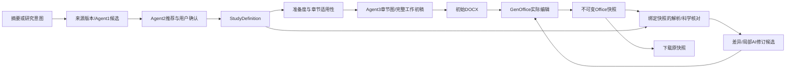

# 架构与工程设计
本文件描述当前真实分层和改造边界，不主张另建平台。

## 数据流

## 组件职责与禁止越界
| 层/组件 | 当前入口 | 职责与修改规则 |
|---|---|---|
| App与双入口 | frontend/src/App.jsx；MedicalWritingSynopsisProjectIntake.jsx；ProtocolIntakeWorkspace.jsx；StudyContextWorkspace.jsx | App仅医学写作挂载/导航，其他模块不碰；摘要legacy调用路由必须与v3事实映射对账 |
| 写作桌面 | ProtocolWritingDesk.jsx；ResearchInformationCard.jsx；RegimenDesignWorkspace/RegimenAdoptionCard.jsx；DesignElementsCards.jsx | 左侧事实/选择，右侧稿件；确认与AI建议身份分离 |
| 稿件任务面 | ManuscriptWorkspace.jsx；protocolWorkspaceApi.mjs | 准备、恢复、进度、历史、整稿保存；不再承担第二段落编辑主库 |
| 原生编辑 | office/GenOfficeFrame.jsx；public/genoffice/bridge-shim.js | 一实例一iframe；冻结打开参数；dirty/save/error消息；当前快照/候选显式选择 |
| renderer工件 | public/genoffice/index.html、assets、embedded.css；scripts/qc/protocol_v3/build_genoffice_renderer.sh | 复用上游引擎；改构建/工件须能重现，不手写Office排版引擎 |
| API组合 | api/composition.py、router.py、research_intake.py、design.py、sources.py、manuscript_sources.py、manuscript_drafts.py | HTTP参数/错误合同与服务组合；不存在的方法不能optional-chain成成功 |
| 应用 | application/service.py、adoption.py、research_context.py、manuscript_documents.py、manuscript_edits.py | 事实采用、版本/CAS、不可变事件和Office保存；保存与语义核对分开 |
| 资料 | agent1/*；api/sources.py、manuscript_sources.py；agent3/source_material.py、source_preparation.py | 原文/来源身份与候选，不擅自确认当前研究参数 |
| 设计 | agent2/clinical_worker.py、design_elements.py、design_cards.py、design_adoption.py、study_input.py、recommendations.py、design_coordinator.py | 问题/推荐/采用闭环；已答问题落正确事实路径；不以模型自报无限阻挡 |
| 写作 | agent3/manuscript_plan.py、draft_readiness.py、manuscript_request.py、chapter_facts.py、chapter_draft.py、manuscript_coordinator.py、coordinator.py | 适用性/准备度→完整内容；独立章节失败隔离；保留完成内容 |
| 对象与文档 | agent3/manuscript_document.py、object_revision.py、synopsis_projection.py、soa_matrix.py、word_export_production.py | AI内容候选与确定性布局分工；投影仅初次生成/显式更新，下载不回灌事实 |
| 运行 | graph/runtime.py；runtime/harness.py、reservations.py、proposal_correction.py、adapters/* | durable run/预约/实际模型回执；只读recover与显式resume分开；未知先对账 |
| 基础持久层 | storage/sqlite.py；events/*；artifacts/local_store.py；ports/* | 现有UoW/SQLite/制品，不另建同类数据库 |
| 模板/条件 | registries/*；config/.../templates/tp_ma_07_v2；packages/contracts/workbench_contracts/protocol_v3.py | 类型、条件三态、章节/字段依赖和版本合同 |
| QC/异常 | qc/*；agent5/* | 定义QC与异常处理，不把文件存在/通过数当医学接受；目录没有独立agent4，不能按旧编号臆造模块 |

上表路径相对实施区；完整绝对链接及文件粒度哈希见SOURCE_MAP.csv。旧Tiptap/legacy组件仍可能被其他模块引用，不可因v3不再使用就卸载公共依赖。

## 当前关键断缝
1. Office快照有真实保存与下载，但旧reconciliation仍读语义稿。应将Office提取/映射结果按快照登记，再复用分析逻辑；不能改标签伪装接线。
2. 新生成语义候选与当前人工Word可能共存，明确采用/继续旧Word；CAS校验当前语义状态不应被误解释为两份内容相等。
3. 文献基础尚需确认是否有当前Office可操作的引用实体/插入API；旧T16说明不够。
4. legacy摘要入口的provider/鉴权与v3链路可不同，StrictMode修复不等于401根因已解除。
5. UI给药补答与已确认事实不是同一路径；修复必须同时到入口、采用、准备度和实际生成输入。
6. 运行现场API使用旧已加载源码，测试隔离服务才有新代码；部署步骤必须绑定源码/运行进程/DB路径。

## 技术路线裁决
继续React/FastAPI/SQLite/GenOffice与已有图/制品；标准库优先。新增轻量Office投影/对象映射适配层可行，不能另建可独立编辑的正文主库。保留已有OCR/翻译共享oMLX gate；暂不为个人部署更换PyMuPDF。退出案例常量、自动全稿重投影、假重试按钮、冗长工程解释。重型框架/新队列/新编辑器只有证明现有实现不可达必要能力后再论证，不默认引入。
